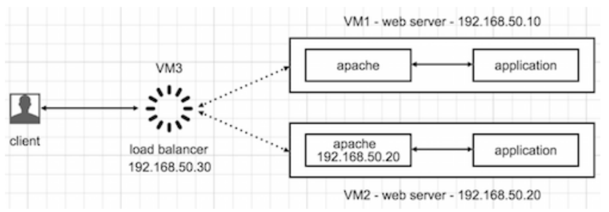

# PROYECTO FINAL 
## Balanceador de carga de servidores web Apache

## Diagrama estructura del proyecto 



## Guía actualizada del proyecto

1. Crear un ambiente de vagrant

### Seleccionamos una carpeta de destino de nuestro proyecto
```bash
vagrant init
```
2. Abrimos el archivo Vagrantfile y modificar con la siguiente configuración:

```bash
Vagrant.configure("2") do |config|
    if Vagrant.has_plugin?("vagrant-vbguest")
        config.vbguest.auto_update = false 
    end
    config.vm.define :servidor1 do |servidor1|
    servidor1.vm.box = "bento/centos-7.9"
    servidor1.vm.network :private_network, ip: "192.168.50.10"
    servidor1.vm.hostname = "servidor1"
    end
    config.vm.define :servidor2 do |servidor2|
    servidor2.vm.box = "bento/centos-7.9"
    servidor2.vm.network :private_network, ip: "192.168.50.20"
    servidor2.vm.hostname = "servidor2"
    end
    config.vm.define :loadbalancer do |loadbalancer|
    loadbalancer.vm.box = "bento/centos-7.9"
    loadbalancer.vm.network :private_network, ip: "192.168.50.30"
    loadbalancer.vm.hostname = "loadbalancer"
    end
end
```

3. El siguiente paso es levantar las maquinas, podemos hacerlo una por una o todas a la vez.

Todas a la vez
```bash
vagrant up 
```

Una por una
```bash
vagrant up loadbalancer
vagrant up servidor1
vagrant up servidor2
```

3.0.1 Accedemos a las maquinas y nos logeamos como root
```bash
vagrant ssh <nombre de la maquina>
sudo -i 
```

## Maquinas seridor1 y servidor2

3.1 En las maquinas servidor1 y servidor2 instalar httpd más un editor en este caso vim
```bash
yum install httpd vim
```

- Crear un archivo index.html que tendra el template que mostrará  para cada máquina:
```bash
vim /var/www/html/index.html
```
- Luego guardamos los cambios y reiniciamos el servicio:
```bash
Presionar la tecla ESC
:wq
service httpd restart
```

## Maquina LoadBalancer

3.2. Para la máquina loadbalancer es necesario realizar la siguiente configuración:
```bash
sudo -i
yum install vim httpd
```
- Luego abrimos el archivo de configuración del servicio http, debemos agregar lo siguiente:
```bash
vim /etc/httpd/conf/httpd.conf
```
- Para utilizar el mod_proxy y el mod_proxy_http, agregamos las siguientes líneas:
```bash
LoadModule proxy_module modules/mod_proxy.so
LoadModule proxy_http_module modules/mod_proxy_http.so
```
- Para configurar el balanceo de carga entre los servidores back-end, es necesario agregar un VirtualHost como se muestra a continuación:
```bash
<VirtualHost *:80>
<Proxy balancer://clusterServicios>
BalancerMember http://192.168.50.10
BalancerMember http://192.168.50.20
ProxySet lbmethod=bytraffic
</Proxy>
ProxyPreserveHost On
ProxyPass "/" "balancer://clusterServicios/"
ProxyPassReverse "/" "balancer://clusterServicios/"
</VirtualHost>
```
- Ahora guardamos los cambios y reiniciamos el servicio:
```bash
Presionamos ESC
:wq
service httpd restart
```


### Nota:

4. Asegurese de que el servicio httpd este activo en todas las maquinas, para esto utilice el comando:
```bash
service httpd status
```
